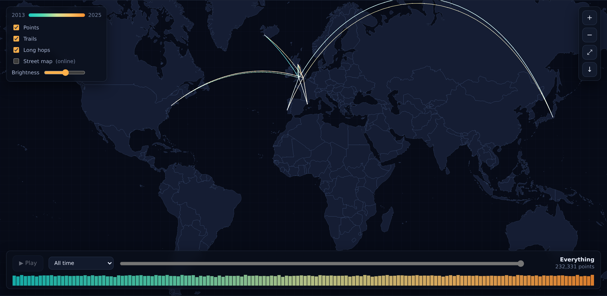

# google-timeline-html

One HTML file that turns a Google Timeline export into a map of everywhere
you have been, plus the numbers underneath it: where you lived each year,
how far you went and by what, when in the week you move, and how many days
you spent in each country and city.

Open `index.html`, drop your export on the page, and that is it. The file
carries its own basemap and place names, so it works with the network
switched off — nothing about your location history is uploaded anywhere,
and there is no server to upload it to.



## Using it

1. Download `index.html` (or clone this repository) and open it in a browser.
2. Get your data:
   - **Everything you have ever recorded** — [Google Takeout](https://takeout.google.com),
     tick *Location History (Timeline)*, and look for `Records.json`.
   - **What is on your phone now** — Google Maps → your picture → *Your Timeline*
     → ⋯ → *Location & privacy settings* → *Export Timeline data*. That gives
     `Timeline.json` on Android or `location-history.json` on iOS.
3. Drop the file anywhere on the page.

A 90 MB export takes a couple of seconds. The file is read in 4 MB slices
and scanned a character at a time, so memory stays flat however big the
export is — a 117 MB, 232,000-point export loads in about 2.6 seconds and
sits in roughly 65 MB of heap.

Every export format Google has shipped works:

| File | What it is |
| --- | --- |
| `Records.json` | the account-wide history, 2013 onwards |
| `Timeline.json` | the current Android on-device export |
| `location-history.json` | the current iOS on-device export |
| `*_JANUARY.json` etc. | the older monthly Semantic Location History files |

## What you get

**The map.** Every recorded position, coloured teal through amber by date.
Points are added into a floating-point accumulation buffer and tone mapped
rather than drawn as shapes, so a city you have lived in for years burns out
white while a single overnight fix on a mountain is still visible. Long hops
are drawn as great-circle arcs. Zoom in and short hops join into trails, so
at street level your own tracks draw the roads.

There is a month-by-month scrubber with a play button, a brightness control,
and a button to save the current view as a PNG.

**The panels.**

- *Where you lived* — from where you were at four in the morning, night by night.
- *How far, and by what* — from Google's own trip segments where the export has
  them, otherwise measured between fixes with the mode inferred from speed.
- *When you move* — distance by hour of the day and day of the week, in local
  time (from the UTC offsets in the export, or estimated from longitude when
  the export only stores UTC).
- *Days per country and city* — point-in-polygon against Natural Earth, with a
  nearest-coast fallback so harbour cities are not put out at sea, and the
  nearest town from GeoNames.
- *Nights away from home* — measured against a rolling 90-day home, so moving
  house does not read as a three-month holiday.

The one thing that touches the network is the optional **street map** tick box,
which pulls OpenStreetMap tiles once you have zoomed in. It is off by default.

## Building it

`index.html` is generated and committed, so you only need this if you are
changing the source.

```sh
python3 tools/fetch_data.py     # vendor Natural Earth + GeoNames from npm
python3 tools/build_assets.py   # re-encode them into assets/
python3 build.py                # inline everything into index.html
```

Layout:

```
src/template.html      the page
src/styles.css         the stylesheet
src/js/00-core.js      integer decoding, projection, geodesy
src/js/10-basemap.js   basemap decoding, drawing, point-in-country, nearest city
src/js/20-map.js       the renderer and all the interaction
src/js/25-tiles.js     the optional street map layer
src/js/30-analysis.js  everything the panels are made of
src/js/40-charts.js    bars, heatmap, month strip
src/js/50-ui.js        wiring
src/js/parser.worker.js  the streaming Takeout parser, run in a worker
assets/                the two data blobs that get embedded
```

## Testing

```sh
python3 tools/make_sample.py --years 3 --out sample   # a simulated itinerary,
                                                      # written in all four formats
node tests/parser-test.mjs sample                     # parser, incl. a chunk-boundary stress
python3 build.py && node tests/e2e.mjs sample         # the built page in Chromium
```

`tests/e2e.mjs` loads the real file in a browser with all network requests
blocked, feeds it each of the four sample formats, and checks that the map
draws from the data and the panels come out right. It then checks the four
formats agree with each other on distance, countries, nights away and long
hops — they describe the same itinerary, so they should.

Screenshots land in `test-output/`.

## Credits

- Coastlines and borders: [Natural Earth](https://www.naturalearthdata.com/)
  (public domain), via [world-atlas](https://github.com/topojson/world-atlas).
- Place names: [GeoNames](https://www.geonames.org/) (CC BY 4.0), via
  [all-the-cities](https://github.com/zeke/all-the-cities).
- Optional street tiles: [© OpenStreetMap contributors](https://www.openstreetmap.org/copyright).

MIT licensed. See [LICENSE](LICENSE).
